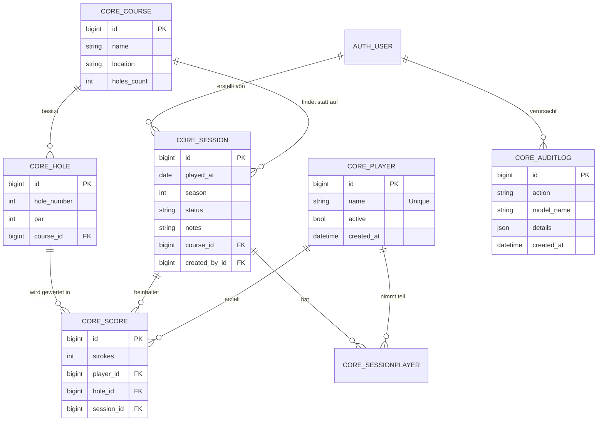

Hier ist die aktualisierte `architektur.md`. Ich habe das Datenmodell um die technischen Tabellendetails aus deinem `inspectdb`-Auszug ergänzt und die Beziehungen präzisiert.

---

# Architektur – #TeamMinigolf

## Überblick

```
┌──────────────┐      ┌──────────────┐      ┌──────────────┐
│    Browser   │────▶│  Django/      │────▶│  MariaDB 11   │
│  (Bootstrap) │◀────│  Gunicorn     │◀────│  (InnoDB)    │
└──────────────┘      └──────────────┘      └──────────────┘
       :8000              web                    db

```

## Stack-Entscheidungen

| Komponente | Wahl | Begründung |
| --- | --- | --- |
| Framework | **Django 5** | Batteries-included (Auth, Admin, ORM, Migrations) |
| DB | **MariaDB 11** | Stabile, performante relationale DB mit InnoDB |
| UI | **Server-rendered** | Django Templates + Bootstrap 5; Fokus auf Funktionalität |
| Deployment | **Docker Compose** | Reproduzierbare Umgebung für App, DB und Backups |

## Datenmodell (ER-Diagramm)

```
CorePlayer (1)──(n) CoreSessionPlayer (n)──(1) CoreSession
                                                  │
CoreCourse (1)──(n) CoreHole                      │
   │               │                              │
   └──(1)──(n) CoreSession (1)──(n) CoreScore ◀───┘
                                     │
                          CorePlayer ◀─┘
                          CoreHole   ◀─┘

CoreAuditLog ← tracks changes (Model-based)

```

### ER-Modell (Mermaid Syntax)

Kopiere diesen Block einfach in deine Markdown-Datei. Viele Editoren (oder Browser-Extensions) rendern daraus sofort ein Diagramm.



### Wichtige Constraints & Logik

* **Unique Constraints**:
* `core_hole`: `unique_together = (course, hole_number)` – Verhindert doppelte Bahnnummern pro Platz.
* `core_score`: `unique_together = (session, player, hole)` – Garantiert, dass ein Spieler pro Bahn und Runde nur ein Ergebnis hat.
* `core_sessionplayer`: `unique_together = (session, player)` – Spieler können nicht doppelt in eine Runde eingetragen werden.


* **Datenintegrität**:
* Alle Fremdschlüssel (`ForeignKey`) nutzen im produktiven Modell idealerweise `on_delete=models.PROTECT`, um das versehentliche Löschen von Kursen oder Spielern mit bestehenden Historien zu verhindern.


* **Audit-Log**:
* Erfasst `action` (Create/Update/Delete) und speichert die Änderungen im `details` JSON-Feld.


## Request-Flow

1. Alle Routen (außer `/health/`) erfordern Login (`@login_required`).
2. Statische Dateien werden über `/static/` ausgeliefert (im Dev-Modus via `django.conf.urls.static`).
3. Scoring-Eingabe erfolgt über ein zentrales Formular oder AJAX-Endpunkte innerhalb einer Session.

## Backup-Strategie

```
┌────────────┐    dump    ┌────────────┐    rsync    ┌────────────┐
│  MariaDB   │ ────────▶ │  Backup    │ ────────▶ │ Raspberry  │
│  Container │           │  Volume    │           │     Pi     │
└────────────┘           └────────────┘           └────────────┘
      db                   backup_data                Remote

```

* **Container**: Ein dedizierter `backup`-Service führt täglich `mariadb-dump` aus.
* **Volumes**: `db_data` (Persistenz), `static_data` (Gesammelte Assets), `backup_data` (Dumps).
* **Rotation**: 30 Tage Vorhaltung auf dem Host-System.

---

Soll ich dir noch ein spezielles SQL-Statement generieren, um die Tabellengrößen oder die aktuelle Belegung deiner Datenbank direkt im Terminal abzufragen?
